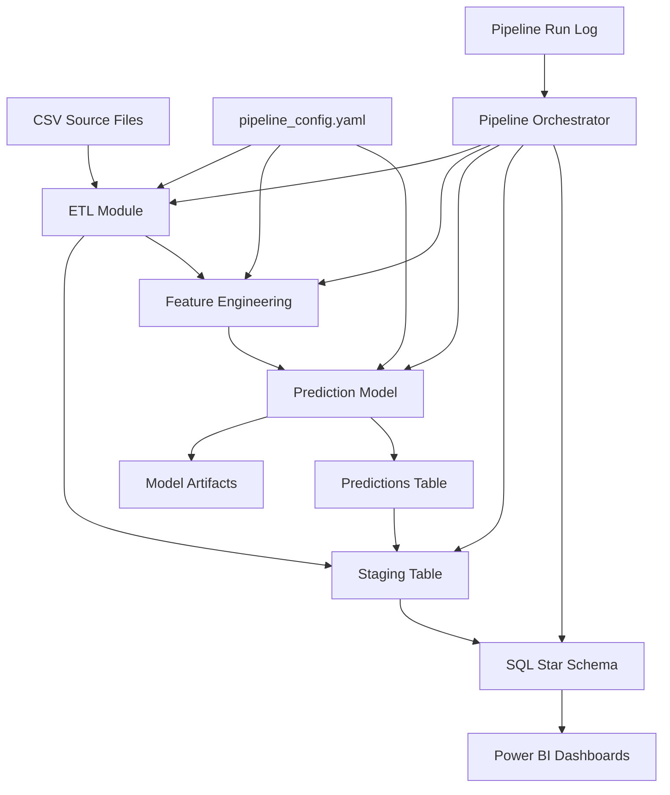

# HR Workforce Analytics & Attrition Prediction

An end-to-end data pipeline that ingests raw employee data, engineers predictive features, trains machine learning models for attrition prediction, loads results into a SQL star schema, and surfaces insights through interactive Power BI dashboards.

This project demonstrates data engineering, data science, and business intelligence skills working together in a single reproducible pipeline.

## Architecture

The system follows a layered pipeline pattern where each stage is independently testable and orchestrated through a single entry-point script.



| Layer | Technology | Responsibility |
|-------|-----------|----------------|
| Orchestration | Python (`main.py`) | Sequencing stages, config loading, logging, error handling |
| Ingestion | Python (pandas) | CSV reading, schema validation, duplicate detection |
| Transformation | Python (pandas, numpy) | Cleaning, feature derivation, encoding |
| Modeling | Python (scikit-learn) | Training, evaluation, serialization, scoring |
| Storage | SQL Server (DDL + stored procedures) | Star schema, referential integrity, idempotent loads |
| Visualization | Power BI (DAX, RLS) | Dashboards, drill-throughs, security roles |

## Project Structure

```
hr-workforce-analytics/
├── main.py                          # Pipeline entry point (CLI)
├── requirements.txt                 # Python dependencies
├── README.md                        # This file
├── config/
│   └── pipeline_config.yaml         # All pipeline parameters
├── src/
│   ├── __init__.py
│   ├── etl/
│   │   ├── __init__.py
│   │   ├── ingestion.py             # DataIngestor: CSV reading, validation, dedup
│   │   └── transformation.py        # DataTransformer: cleaning, feature engineering, encoding
│   ├── model/
│   │   ├── __init__.py
│   │   ├── trainer.py               # ModelTrainer: train, evaluate, serialize models
│   │   └── scorer.py                # ModelScorer: generate attrition probabilities
│   ├── pipeline/
│   │   ├── __init__.py
│   │   ├── models.py                # Shared data classes (PipelineResult, StageResult, etc.)
│   │   └── orchestrator.py          # PipelineOrchestrator: stage sequencing and logging
│   ├── sql/
│   │   ├── __init__.py
│   │   ├── loader.py                # SQLDataLoader: staging load, stored proc execution
│   │   ├── ddl/                     # Table creation scripts
│   │   │   ├── dim_employee.sql
│   │   │   ├── dim_department.sql
│   │   │   ├── dim_job_role.sql
│   │   │   ├── dim_location.sql
│   │   │   ├── dim_date.sql
│   │   │   ├── fact_employee_metrics.sql
│   │   │   └── stg_employee_data.sql
│   │   ├── procedures/
│   │   │   └── sp_load_star_schema.sql  # SCD Type 1 load logic
│   │   └── views/
│   │       ├── vw_turnover_summary.sql
│   │       └── vw_diversity_metrics.sql
│   └── powerbi/
│       ├── dax_measures/
│       │   ├── turnover_measures.md
│       │   ├── diversity_measures.md
│       │   └── department_measures.md
│       ├── layouts/
│       │   └── dashboard_spec.md
│       └── security/
│           └── rls_config.md
├── tests/
│   ├── __init__.py
│   ├── test_ingestion.py
│   ├── test_ingestion_nulls_dedup.py
│   ├── test_transformation.py
│   └── test_trainer.py
├── logs/                            # Pipeline run logs (auto-generated)
└── artifacts/                       # Model artifacts (auto-generated)
```

## Prerequisites

- **Python 3.10+**
- **SQL Server** (or PostgreSQL) with ODBC Driver 17 for SQL Server
- **Power BI Desktop** (for viewing/editing dashboards)
- **Git** (for version control)

## Setup Instructions

### 1. Clone the Repository

```bash
git clone <repository-url>
cd hr-workforce-analytics
```

### 2. Create a Virtual Environment

```bash
python -m venv venv

# Windows
venv\Scripts\activate

# macOS / Linux
source venv/bin/activate
```

### 3. Install Dependencies

```bash
pip install -r requirements.txt
```

### 4. Database Setup

1. Create a SQL Server database named `hr_analytics`
2. Run the DDL scripts to create the star schema:

```bash
# Execute in order:
sqlcmd -S localhost -d hr_analytics -i src/sql/ddl/dim_employee.sql
sqlcmd -S localhost -d hr_analytics -i src/sql/ddl/dim_department.sql
sqlcmd -S localhost -d hr_analytics -i src/sql/ddl/dim_job_role.sql
sqlcmd -S localhost -d hr_analytics -i src/sql/ddl/dim_location.sql
sqlcmd -S localhost -d hr_analytics -i src/sql/ddl/dim_date.sql
sqlcmd -S localhost -d hr_analytics -i src/sql/ddl/fact_employee_metrics.sql
sqlcmd -S localhost -d hr_analytics -i src/sql/ddl/stg_employee_data.sql
sqlcmd -S localhost -d hr_analytics -i src/sql/views/vw_turnover_summary.sql
sqlcmd -S localhost -d hr_analytics -i src/sql/views/vw_diversity_metrics.sql
sqlcmd -S localhost -d hr_analytics -i src/sql/procedures/sp_load_star_schema.sql
```

3. Update the connection string in `config/pipeline_config.yaml` to match your environment.

### 5. Configure the Pipeline

Edit `config/pipeline_config.yaml` to set:
- `ingestion.required_columns` — columns expected in your source CSV
- `ingestion.null_strategy` — `"drop"` or `"fill_default"`
- `transformation.encoding_strategy` — `"label"` or `"onehot"`
- `model.random_seed` — seed for reproducible results
- `database.connection_string` — your SQL Server connection string
- `pipeline.log_path` — where to write run logs

## Usage

### Run the Full Pipeline

```bash
python main.py --config config/pipeline_config.yaml
```

This executes all stages sequentially:
1. **Ingestion** — reads CSV, validates schema, handles nulls, deduplicates
2. **Transformation** — standardizes columns, derives features, encodes categoricals
3. **Modeling** — trains logistic regression and random forest, evaluates, serializes best model
4. **SQL Loading** — loads scored data into staging, executes stored procedure to populate star schema

### Run Tests

```bash
python -m pytest tests/ -v
```

### Run a Specific Test Module

```bash
python -m pytest tests/test_ingestion.py -v
python -m pytest tests/test_transformation.py -v
python -m pytest tests/test_trainer.py -v
```

## Dependencies

| Package | Version | Purpose |
|---------|---------|---------|
| pandas | 2.2.2 | Data manipulation and CSV reading |
| numpy | 1.26.4 | Numerical operations |
| scikit-learn | 1.5.1 | ML model training and evaluation |
| pyyaml | 6.0.1 | YAML configuration parsing |
| sqlalchemy | 2.0.31 | Database connectivity and ORM |
| pyodbc | 5.1.0 | ODBC driver interface for SQL Server |
| joblib | 1.4.2 | Model serialization |
| pytest | 8.2.2 | Testing framework |

## Pipeline Stages

### Ingestion (`src/etl/ingestion.py`)

Reads raw employee CSV data, validates that all required columns are present, applies configurable null-handling (drop rows or fill with defaults), and deduplicates records by employee ID keeping the most recent entry by hire date.

### Transformation (`src/etl/transformation.py`)

Standardizes column names to snake_case, enforces consistent data types, and derives analytical features:
- **tenure_months** — months since hire date
- **age_group** — bucketed age ranges (Under 25, 25-34, 35-44, 45-54, 55+)
- **salary_band** — categorized salary levels (Entry, Mid, Senior, Executive, Top)
- **overtime_flag** — binary flag for overtime hours exceeding threshold
- **promotion_recency** — months since last promotion

Categorical columns are encoded using label encoding or one-hot encoding based on configuration.

### Modeling (`src/model/trainer.py`, `src/model/scorer.py`)

Trains logistic regression and random forest classifiers on an 80/20 train/test split with a deterministic seed. Models are evaluated on accuracy, precision, recall, F1-score, and AUC-ROC. The best model is serialized as a `.joblib` artifact. The scorer generates per-employee attrition probabilities.

### SQL Loading (`src/sql/loader.py`)

Bulk-inserts the scored DataFrame into a staging table, then executes a stored procedure that applies SCD Type 1 logic to populate dimension and fact tables. Row count validation ensures data integrity, and transactions roll back on failure.

### Visualization (Power BI)

Three dashboard pages consume the star schema:
- **Turnover Analysis** — attrition rates by department, role, and tenure with time-series trends
- **Diversity Metrics** — workforce composition by gender, ethnicity, and age group
- **Department Insights** — scorecards with predicted attrition risk and drill-through to employee profiles

## Power BI Dashboard Setup

1. Open Power BI Desktop
2. Connect to the `hr_analytics` SQL Server database
3. Import or DirectQuery the star schema tables and views (`vw_turnover_summary`, `vw_diversity_metrics`)
4. Apply the DAX measures documented in `src/powerbi/dax_measures/`
5. Configure page layouts per `src/powerbi/layouts/dashboard_spec.md`
6. Set up Row-Level Security roles per `src/powerbi/security/rls_config.md`

## License

This is a portfolio project for demonstration purposes.
